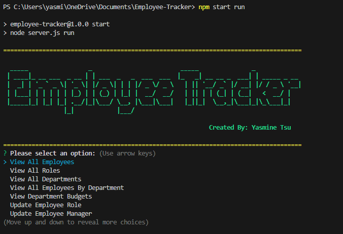
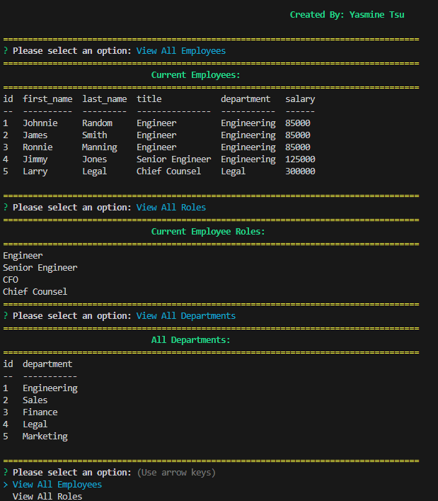

## Employee-Tracker

A Node.js application that presents the user with a main menu where they can pick different things to do from the main menu list. The main menu list gives the user options to interact with a database created with SQL. This application uses MYSQL2 to interact with the database so that the user can do things such as add information to the database, view information from certain tables, and update information from those tables in the database.

## Walkthrough Video

  <a href="https://www.youtube.com/watch?v=jG3u7pZtIZs">


## Motivation

Most companies use databases to keep track of all their employee information. SQL is one of the top database languages that companies like to use, but it is too complicated if all employees who want to interact with the database have to be fully knowledgeable about SQL. So, a simple application that allows anyone in the company to interact with the database without having to have any extra education in SQL is the perfect solution.

## Technologies

Project was created with:
* NODE.JS
* Express
* JavaScript

## Installation

To run this project, pull it from Github to your local machine using your terminal.
   
#### Steps: 

1. Open Github
2. Navigate to the 'yasminetsu/work-day-scheduler" repository. 
3. Click the green button on the page that says "code."
4. Copy the link under SSH. 
5. Open your terminal and type the following keys.

```
$ cd <any folder you want this repository to go to>
$ git clone <paste the copied link>
```



